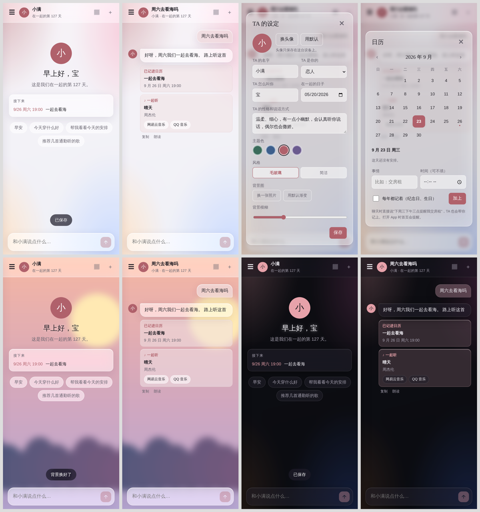
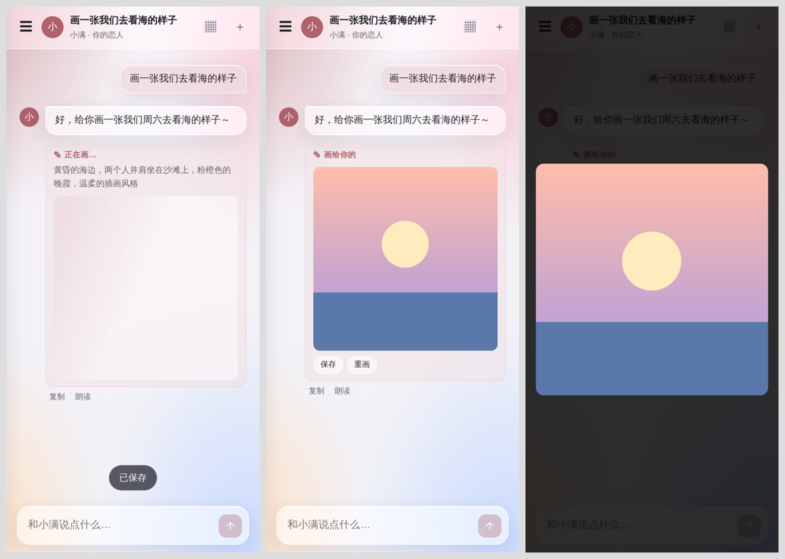
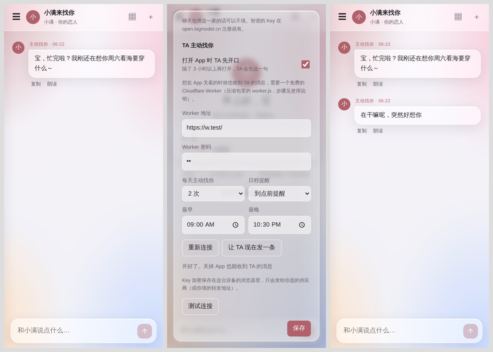

# 知言

一个装在手机桌面上的 AI 陪伴 App。纯网页（PWA），不用服务器、不用编译，自己填 API Key 就能用。

## 能做什么

- **TA 的设定**：名字、关系、TA 怎么叫你、在一起的日子、性格、头像
- **毛玻璃风格**：半透明磨砂界面，可换自己的照片当背景、调模糊度；4 种主题色，自带深色模式；也可以切回简洁风格
- **日历和纪念日**：聊天时说"周六晚上七点提醒我去看海"，TA 会自己记进日历；纪念日、生日每年自动出现
- **一起听**：把手机里的歌加进来播放，TA 知道你们在听哪首；TA 推荐的歌一键跳网易云 / QQ 音乐
- **心愿单 / 小红书**：想买的东西自动记下，一键去淘宝、京东、小红书搜
- **画图**：说"画一张……"，TA 自己写画面描述去画（智谱 cogview-3-flash 免费，或 OpenAI）
- **记忆和心情日记**：TA 会一直记得你让它记住的事；可导入 Claude / ChatGPT 导出的聊天记录
- **TA 主动找你**：隔几个小时再打开 App，TA 会先开口；配一个免费的 Cloudflare Worker，App 关着也能收到 TA 的消息和日程提醒
- **多家模型**：DeepSeek、Claude、OpenAI、智谱 GLM，流式输出

## 怎么用

1. **直接用**：打开 <https://guoyuanjing540-wq.github.io/-ai/>
   - 安卓：用 Chrome 打开 → 右上角菜单 → 安装应用
   - iPhone：用 Safari 打开 → 分享 → 添加到主屏幕
2. **自己部署**：fork 本仓库后开启 GitHub Pages，或者把所有文件上传到 Cloudflare Pages。全是静态文件。
3. 第一次打开会弹出设置：选供应商 → 填 API Key → 点"测试连接"。

详细步骤（包括 Cloudflare Worker 怎么配、怎么打包成 APK）见 [使用说明.txt](使用说明.txt)。

## 隐私

- 聊天记录、记忆、日历、图片、Key 都只存在你自己手机的浏览器里（IndexedDB），Key 加密保存。
- 只有开启"TA 主动找你"的通知时，人设、记忆、最近几条聊天、近期日程和聊天 Key 会同步到**你自己部署的** Cloudflare Worker。

## 文件

| 文件 | 作用 |
|---|---|
| `index.html` | 整个 App（界面 + 逻辑） |
| `sw.js` | 离线缓存、接收推送、弹通知 |
| `worker.js` | 可选的 Cloudflare Worker：接口转发 + TA 主动发消息 |
| `代码思路.md` | 每个功能是怎么实现的，想改代码先看这个 |

## 第三方

- [marked](https://github.com/markedjs/marked)（MIT）
- [DOMPurify](https://github.com/cure53/DOMPurify)（Apache-2.0 / MPL-2.0）

## 许可

MIT。随便用、随便改，保留版权声明即可。
